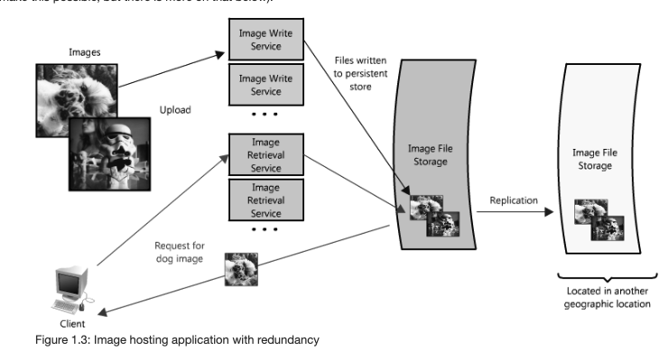

# Scalable Web Architecture and Distributed Systems

from: [http://aosabook.org/en/distsys.html](http://aosabook.org/en/distsys.html)

###

### Summary

4 key point to consider is : **Availability, Performance, Reliability, Scalability, Manageability, Cost.**

 (1).png>)

### Divide services

 (1).png>)

### Redundancy

### Partitions

.png>)

